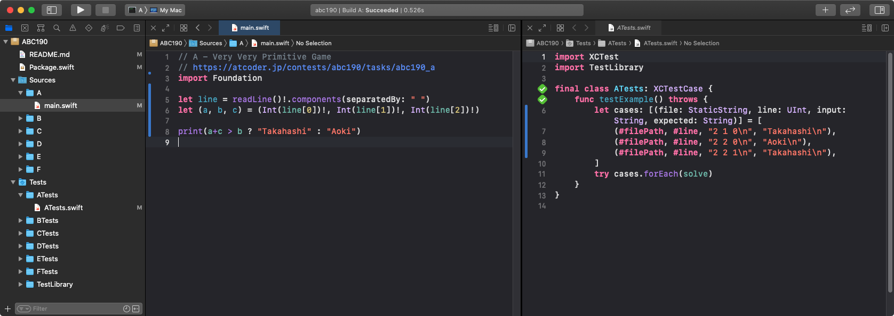

# AtCoderCLI for Swift (accs)

[AtCoder](https://atcoder.jp/?lang=ja) command line tools for Swift



- コンテスト毎に Xcode プロジェクトを作成します
- 問題ごとにサンプルテストケースを作成します

## Requirements

[online-judge-tools](https://github.com/online-judge-tools/oj) ([インストール手順](https://github.com/online-judge-tools/oj#how-to-install))

コンテスト情報の取得のため、`oj-api` というコマンドを内部で使用しています。

## Install

```bash
git clone https://github.com/ShotaKashihara/atcoder-cli-swift
cd atcoder-cli-swift
swift build -c release
cp -f .build/release/accs /usr/local/bin/.
```

## Usage

コンテスト名から Xcode プロジェクトの作成

```bash
accs new abc190
```

作成したプロジェクトを開く

```
open abc190/Package.swift
```

`Sources/A/main.swift` を開いて問題を解きます
